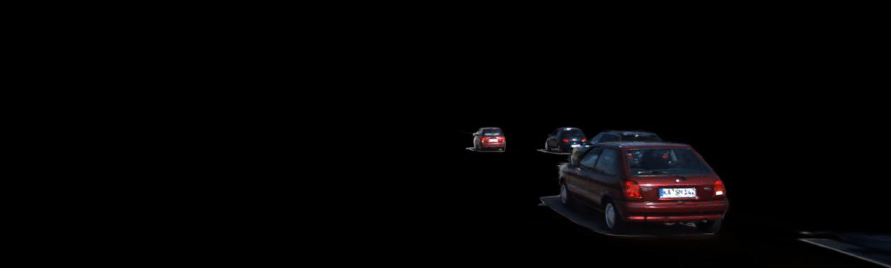

<div align="center"><h2>DENSER: 3D Gaussians Splatting for Scene Reconstruction of Dynamic Urban Environments</h2></div>

<div align="center"><h4>Scene Reconstruction Results</h4></div>

<div align="center"><h4>Ground Truth</h4></div>
<div align="center">
  
</div>

<div align="center"><h4>Reconstruction</h4></div>
<div align="center">
  
</div>

<!-- <div align="center"><h4>Object Output</h4></div> -->
<div align="center">
  
</div>


## Installation

## Installing DENSER:

### Create environment
```
conda create --name denser -y python=3.8
conda activate denser
pip install --upgrade pip
```
### Clone the Repository
```
git clone https://github.com/sntubix/denser.git --recursive
```
### Install Dependencies
```
cd DENSER
bash installation.sh
```
### Install denser 
```
pip install -e .
```
## Data Organization

The KITTI-MOT dataset should be organized as follows:

```
.(KITTI_MOT_ROOT)
└── training
    ├── calib
    │   └── sequence_id.txt
    ├── completion_02                # (Optional) depth completion
    │   └── sequence_id
    │       └── frame_id.png
    ├── completion_03                # (Optional) depth completion
    │   └── sequence_id
    │       └── frame_id.png
    ├── image_02
    │   └── sequence_id
    │       └── frame_id.png
    ├── image_03
    │   └── sequence_id
    │       └── frame_id.png
    ├── label_02
    │   └── sequence_id.txt
    ├── object_lidars
    │   └── object_id.txt
            ....
    └── oxts
        └── sequence_id.txt
```


## Training,Rendering,Evaluation

```
ds-train denser --data /data/kitti/image_02/0006'
ds-render --load_config /path/to/your/config/config.yml
ds-eval --load_config /path/to/your/config/config.yml
```
## preprocessed Datasets

coming soon

## pretrained models

coming soon

## Citation
```
@misc{mohamad2024denser,
      title={DENSER: 3D Gaussians Splatting for Scene Reconstruction of Dynamic Urban Environments}, 
      author={Mahmud A. Mohamad and Gamal Elghazaly and Arthur Hubert and Raphael Frank},
      year={2024},
      eprint={2409.10041},
      archivePrefix={arXiv},
      primaryClass={cs.CV},
      url={https://arxiv.org/abs/2409.10041}, 
}
```
